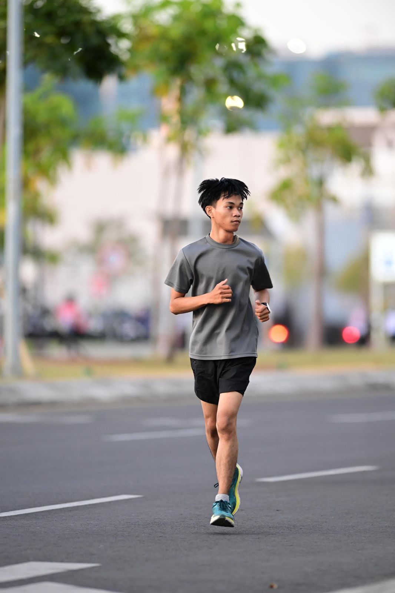

<h2>Analisa kode program</h2>

```css
<style>
    body {
      margin: 0;
      font-family: Arial, sans-serif;
      background-color: #cef4e7;
      color: #333;}
```
Bagian CSS di atas mengatur tampilan dasar halaman. Pertama, margin dibuat nol supaya halaman tidak punya jarak di pinggir dan terlihat lebih rapi. Lalu, huruf yang dipakai adalah Arial (atau huruf mirip kalau tidak ada), supaya tulisan mudah dibaca. Setelah itu, warna latar belakang halaman diberi hijau muda dengan kode #cef4e7, biar kelihatan segar. Terakhir, warna teks diatur jadi abu-abu tua dengan kode #333, supaya tulisan jelas dan nyaman dibaca.

```css
html {
      scroll-behavior: smooth;}
```
bikin efek geser halus waktu kita pindah ke bagian lain di halaman pada saat klik tentang dll dibagian atas.

```css
header {
      display: flex;
      justify-content: space-between;
      align-items: center;
      padding: 15px 50px;
      background: #f4f7f6;
      position: sticky;
      top: 0;
      z-index: 1000;
    }
    header h2 { margin: 0; }
    nav ul {
      list-style: none;
      display: flex;
      gap: 20px;
      margin: 0;
      padding: 0;
    }
```
Bagian CSS ini ngurusin kepala halaman (header)<br>
 display: flex; bikin isi header sejajar.<br>
 justify-content: space-between; bikin tulisan di kiri, menu di kanan, ada jarak rapi.<br>
 align-items: center; biar isinya rata di tengah secara vertikal.<br>
 padding: 15px 50px; kasih bantalan, biar nggak mepet pinggir.<br>
 background: #f4f7f6; kasih warna abu muda di belakang.<br>
 position: sticky; top: 0; artinya header nempel di atas kalau kita scroll ke bawah.<br>
 z-index: 1000; biar header tetap di atas semua elemen lain.

Lalu header h2 { margin: 0; } artinya judul di header nggak dikasih jarak ekstra.<br>
Sedangkan nav ul ngatur menu:<br>
 list-style: none; buang titik-titik list.<br>
 display: flex; bikin menu berdampingan.<br>
 gap: 20px; kasih jarak antar menu.<br>
 margin: 0; padding: 0; biar rapi, nggak ada jarak bawaan dari list.

```css
nav ul li { display: inline; }
    nav ul li a {
      text-decoration: none;}
```
nav ul li { display: inline; } artinya tiap item menu ditaruh berdampingan ke samping, bukan ke bawah. <br>nav ul li a { ... } ngatur gaya link-nya:

```css
section {
      padding: 60px 10%;
    }
    .hero {
      display: flex;
      justify-content: center;
      align-items: center;
      gap: 50px;
    }
    .profile {
      flex: 1;
      max-width: 300px;
      background: #ffffff;
      border-radius: 16px;
      padding: 30px;
      text-align: center;
      box-shadow: 0 4px 12px rgba(0,0,0,0.1);}
```
Kode section { padding: 60px 10%; } itu artinya setiap bagian halaman dikasih ruang kosong di dalamnya, atas-bawah 60px, kiri-kanan 10% dari layar, supaya isinya nggak terlalu mepet. Lalu .hero { display: flex; justify-content: center; align-items: center; gap: 50px; } dipakai buat bikin bagian utama (hero) jadi sejajar secara horizontal, rata tengah, dan ada jarak 50px antar elemennya. Sedangkan .profile { ... } dipakai buat kotak profil, diatur maksimal lebarnya 300px, warnanya putih, sudutnya bulat 16px, ada ruang dalam 30px, isi teksnya rata tengah, dan ada bayangan halus biar kelihatan seperti kartu yang rapi.

```css
.profile img {
      width: 180px;
      height: 180px;
      border-radius: 50%;
      object-fit: cover;
      margin-bottom: 20px;
      border: 3px solid #ddd;
    }
    .profile h3 { margin: 10px 0 5px; font-size: 22px; }
    .profile p { font-size: 14px; color: #666; }
    .profile .social {
      margin-top: 15px;
      display: flex;
      justify-content: center;
      gap: 15px;
    }
    .profile .social a {
      font-size: 22px;
      color: #333;
      transition: color 0.3s;
}

    .profile .social a:hover {
      color: #2980b9;}
```
Bagian .profile img dipakai untuk ngatur foto profil. Lebarnya 180px, tingginya 180px, dibikin bulat penuh dengan border-radius: 50%, lalu gambarnya dipaksa pas kotak dengan object-fit: cover. Ada jarak bawah 20px, plus bingkai tipis abu-abu muda 3px. Selanjutnya, .profile h3 dipakai untuk nama, dikasih margin atas-bawah kecil dan ukuran huruf 22px supaya lebih menonjol. Lalu .profile p dipakai untuk teks deskripsi singkat, dengan ukuran huruf lebih kecil (14px) dan warna abu-abu lembut.

Bagian .profile .social itu untuk menaruh ikon sosmed. Dikasih jarak atas 15px, posisinya di tengah, dan jarak antar ikon 15px. Lalu .profile .social a ngatur gaya ikon: ukurannya 22px, warnanya abu-abu tua, dan ada efek halus ketika disentuh (transition). Nah, kalau kursor diarahkan (:hover), warnanya berubah jadi biru (#2980b9) biar lebih interaktif.

```css
.intro { flex: 2; background: #ffffff; padding: 40px; border-radius: 16px; box-shadow: 0 4px 12px rgba(0,0,0,0.1); } .intro h1 { font-size: 28px; margin-bottom: 20px; } .intro h1 span { color: #2980b9; } .intro p { font-size: 16px; margin-bottom: 20px; color: #555; } .intro .status { color: green; font-size: 14px; margin-bottom: 20px; } .btn { display: inline-block; padding: 10px 20px; background: #2980b9; color: #fff; text-decoration: none; border-radius: 8px; }
```
Bagian .intro ini dipakai untuk kotak perkenalan di samping profil. Kotaknya lebih besar (karena flex: 2), warnanya putih, ada ruang dalam 40px, sudutnya bulat halus 16px, dan ada bayangan lembut biar terlihat menonjol. Di dalamnya, judul utama (.intro h1) dibuat besar dengan ukuran huruf 28px dan ada jarak bawah. Kalau ada kata di dalam <span>, warnanya berubah jadi biru (#2980b9) supaya lebih menonjol. Teks paragraf (.intro p) dibuat ukuran sedang 16px dengan warna abu-abu gelap biar nyaman dibaca. Status (.intro .status) ditampilkan dengan huruf kecil 14px dan warna hijau, jadi kelihatan kayak indikator aktif.

Terakhir, ada tombol (.btn) yang tampil seperti kotak biru dengan teks putih. Tombol ini punya padding biar pas, sudut agak bulat (8px), dan teksnya tidak ada garis bawah. Jadi kelihatan modern dan gampang diklik.

```css
.section-box {
      background: #fff;
      border-radius: 16px;
      box-shadow: 0 4px 12px rgba(0,0,0,0.1);
      padding: 40px;
      margin-bottom: 40px;
    }
    .section-box h2 {
      color: #2980b9;
      margin-bottom: 20px;
    }
    .skills ul {
      list-style: none;
      padding: 0;
    }
    .skills ul li {
      background: #eaf6f9;
      margin: 8px 0;
      padding: 10px;
      border-radius: 8px;}
```
Bagian .section-box ini dipakai untuk bikin setiap kotak isi (seperti tentang, pendidikan, skill, dll.) terlihat rapi. Kotaknya berwarna putih, sudutnya bulat halus 16px, ada bayangan lembut biar kelihatan mengambang, isinya diberi ruang dalam 40px, dan bawahnya ada jarak 40px supaya tidak menempel dengan bagian lain. Judul dalam kotak (.section-box h2) dibuat warna biru (#2980b9) dan ada jarak bawah 20px supaya lebih menonjol.

Untuk bagian skill, daftar (.skills ul) tidak pakai tanda titik (list-style: none) dan padding-nya dihilangkan biar bersih. Lalu tiap item skill (.skills ul li) dibuat dengan latar biru muda (#eaf6f9), ada jarak antar item 8px, isi dalam 10px, dan sudutnya bulat 8px supaya terlihat seperti kotak-kotak kecil yang rapi.

```html
<nav>
      <ul>
        <li><a href="#tentang">Tentang</a></li>
      </ul> 
<link rel="stylesheet" href="https://cdnjs.cloudflare.com/ajax/libs/font-awesome/6.5.0/css/all.min.css">
```
Kode nav ... dipakai untuk bikin menu navigasi di atas halaman.

Di dalamnya ada ul (list/tabel daftar) dengan beberapa li (item daftar).
Setiap li berisi a (link) yang tujuannya lompat ke bagian tertentu di hal

Lalu ada < link rel="stylesheet.. > yang memanggil Font Awesome.
Fungsinya biar kamu bisa pakai icon-icon (seperti logo Instagram, GitHub, LinkedIn, dll.) tanpa harus download gambarnya.

```html
<section class="hero">
    <div class="profile">
      
<div class="social">
      <a href="https://github.com/" target="_blank"><i class="fab fa-github"></i></a>
```
Kode < section class="hero" > itu artinya bikin satu bagian khusus di halaman, namanya hero (biasanya bagian utama yang pertama dilihat orang).
Di dalamnya ada < div class="profile">, isinya:
< img src="img/irhamRun.jpg" alt="Foto Profil"> → ini gambar profil saya.
src = alamat gambarnya.
Lalu ada < div class="social" >, isinya kumpulan link sosmed.

```html
<footer>
    © 2025 Muh. Irham Praditya -Dibuat menggunakan HTML dan CSS
  </footer>
```
<footer> adalah tag HTML khusus buat bagian bawah halaman (penutup). Biasanya isinya copyright, info pembuat, atau link penting
