<h2>Praktikum 5</h2>

<h2>1. menggunakan tag</h2>

Output: 
Gambar 1

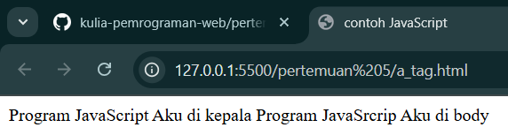

analisis:
1. Tag `` digunakan untuk menutup bagian JavaScript.

<h2>2. Event Tertentu</h2>

Output: 
Gambar 1

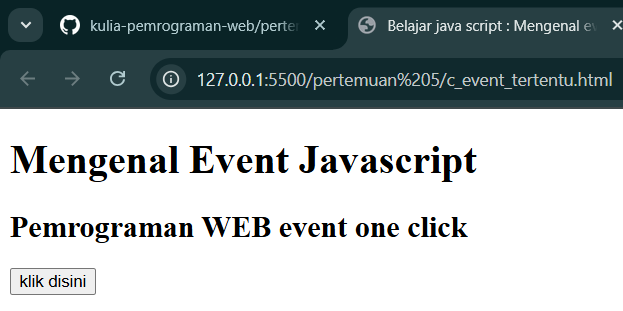

Gambar 2

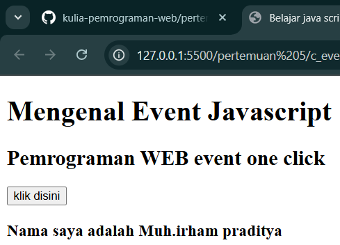

Analisis:

1. Kode `<button onclick="tampilkan_nama()">`klik disini</button> membuat sebuah tombol di halaman web. Saat tombol ini diklik, fungsi JavaScript tampilkan_nama() akan dijalankan. 

2. Elemen `

` adalah wadah kosong yang diberi id="hasil". Wadah ini nanti diisi oleh JavaScript ketika tombol ditekan. 

3. Bagian `` berisi kode JavaScript. Di dalamnya terdapat fungsi tampilkan_nama().
Fungsi ini menggunakan `document.getElementById("hasil").innerHTML = ...` untuk mencari elemen dengan id hasil dan mengubah isinya. Isi tersebut berupa teks HTML `<h3>Nama saya adalah Muh.irham praditya</h3>`. 

4. Ketika tombol diklik, tulisan "Nama saya adalah Muh.irham praditya" akan muncul di dalam `
` dengan gaya heading 3.

<h2>3. Contoh Sederhana</h2>

Output: 
Gambar 1

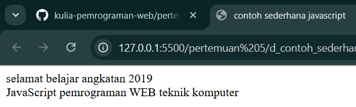

Analisi:
1. `Tag <script language="javascript">` digunakan untuk menandai bahwa bagian ini berisi kode JavaScript.

2. Baris `document.write("selamat belajar angkatan 2019"," ")`; berfungsi menuliskan teks "selamat belajar angkatan 2019" ke dalam halaman web, lalu menambahkan elemen ` ` yang berarti baris baru.

3. Baris `document.write("JavaScript pemrograman WEB teknik komputer");` menuliskan teks "JavaScript pemrograman WEB teknik komputer" tepat di bawah baris sebelumnya, karena adanya tag ` ` tadi.

<h2>4. Memasukkan data</h2>

Output: 
Gambar 1

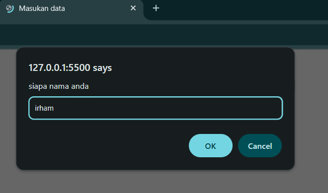

Gambar 2

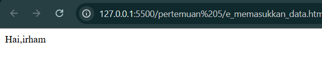

Analisi:
1. Baris `var nama = prompt("siapa nama anda");`digunakan untuk menampilkan kotak dialog input pada browser. Kotak ini meminta pengguna memasukkan nama mereka. Nilai yang diketik oleh pengguna akan disimpan ke dalam variabel nama.

2. Baris `document.write("Hai," + nama);` digunakan untuk menampilkan teks ke halaman web. Teks yang ditampilkan adalah `"Hai,"` ditambah dengan isi variabel nama. Jika pengguna mengetik Irham, maka hasil yang muncul di halaman adalah Hai,Irham.

<h2>5. Jendela Peringantan</h2>

Output: 
Gambar 1

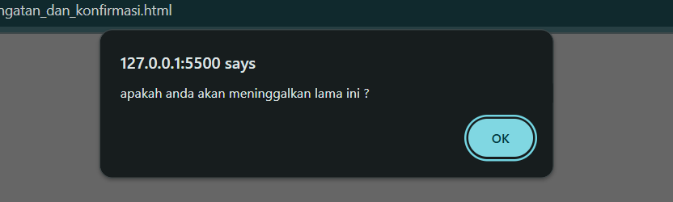

Analisis:
1. Baris `window.alert("apakah anda akan meninggalkan lama ini ?");` memanggil fungsi alert pada objek global window untuk menampilkan kotak dialog peringatan (modal) berisi teks `"apakah anda akan meninggalkan lama ini ?".` 
Kotak dialog ini menghentikan interaksi dengan halaman sampai pengguna menekan tombol OK, dan hanya menampilkan pesan tanpa memberi pilihan Ya/Tidak.

<h2>6. Jendela Konfirmasi</h2>

Output: 
Gambar 1

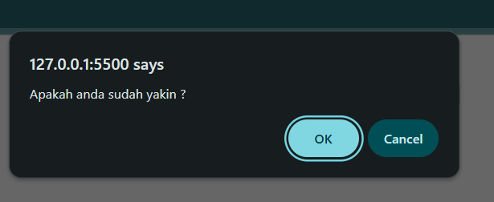

Gambar 2

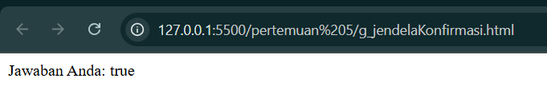

Gambar 3

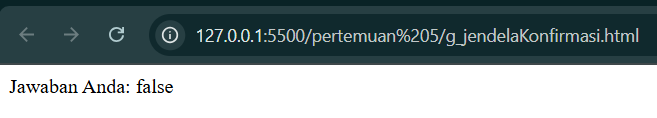

Analisis:
1. Baris `var jawaban = window.confirm("Apakah anda sudah yakin ?");` menampilkan kotak dialog konfirmasi pada browser. Kotak ini berisi pesan `"Apakah anda sudah yakin ?" dengan dua pilihan tombol, yaitu OK dan Cancel.`

2. Jika pengguna menekan tombol OK, maka variabel jawaban akan bernilai true. Jika menekan tombol Cancel, maka nilainya false.

3. Baris `document.write("Jawaban Anda: " + jawaban);` akan menuliskan hasil pilihan pengguna langsung ke halaman web.

<h2>7. Deklarasi Variabel</h2>

Output: 
Gambar 1

Analisis:
1. Baris `var variabelKu;` membuat sebuah variabel bernama variabelKu tanpa memberikan nilai awal. Nilainya masih undefined.

2. Baris `var variabelKu2 = 3;` membuat variabel variabelKu2 sekaligus mengisinya dengan angka 3.

3. Baris `variabelKu = 1234;` memberi nilai 1234 ke dalam variabel variabelKu. 
Baris `document.write(variabelKu * variabelKu2);` menuliskan hasil perkalian antara `variabelKu` dan `variabelKu2` ke halaman web. Karena `variabelKu bernilai 1234` dan `variabelKu2 bernilai 3`

<h2>8. Global</h2>

Output: 
Gambar 1

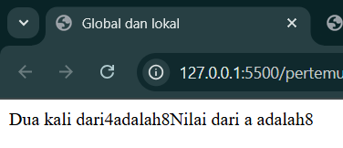

Analisa:
1. Baris `var a = 12;` membuat variabel `a` dengan nilai awal 12.

2. Baris `var b = 4;` membuat variabel `b` dengan nilai awal 4.

3. Baris function `perkalian_Dengan2(b)` { ... } mendefinisikan sebuah fungsi bernama `perkalian_Dengan2` yang menerima satu parameter `b`.
Di dalam fungsi, `a = b * 2;` menghitung hasil `b` dikali 2 lalu menyimpan hasilnya ke variabel `a`. Nilai `a` kemudian dikembalikan dengan `return a;`.

4. Baris `document.write("Dua kali dari " + b + " adalah " + perkalian_Dengan2(b) + " ");` menuliskan kalimat ke halaman web. Variabel `b` bernilai 4, sehingga `perkalian_Dengan2(b)` menghasilkan 8.

<h2>9. lokal</h2>

Output: 
Gambar 1

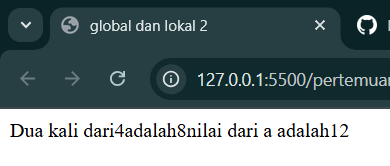

Analisa:
1. Di dalam fungsi dibuat variabel lokal `a` dengan `var a = b * 2;`. Karena menggunakan `var` lagi, variabel `a` ini hanya berlaku di dalam fungsi, berbeda dengan variabel global `a`. Fungsi lalu mengembalikan hasil perkalian `b * 2.`

2. Pemanggilan `document.write("Dua kali dari " + b + " adalah " + perkalian_Dengan2(b) + " ");` akan menampilkan hasil fungsi. Karena `b `bernilai 4, maka `perkalian_Dengan2(b)` bernilai 8.

<h2>10. Konversi Tipe Data</h2>

Output: 
Gambar 1

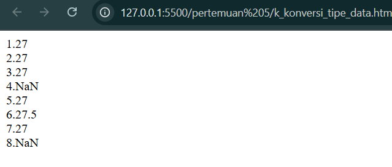

Analisis:
1. Baris pertama `var a = parseInt("27");` mengubah string `"27"` menjadi bilangan bulat. Hasilnya adalah 27.
2. Baris `a = parseInt("27.5");` mengambil bagian integer dari string `"27.5"`, sehingga hasilnya 27.
3. Baris `var a = parseInt("27A");` masih bisa membaca angka di depan `(27)` lalu berhenti saat menemui huruf. Hasilnya 27.
4. Baris `a = parseInt("A27.5");` tidak menemukan angka di awal string, sehingga hasilnya NaN (Not a Number).
5. Baris var `b = parseFloat("27");` mengubah string "27" menjadi bilangan pecahan. Hasilnya 27.
6. Baris `b = parseFloat("27.5");` mengubah string `"27.5"` menjadi angka pecahan 27.5.
7. Baris var `b = parseFloat("27A");` membaca angka di depan `(27)` lalu berhenti saat menemui huruf, hasilnya 27.
8. Baris `b = parseFloat("A27.5");` tidak menemukan angka di awal string, sehingga hasilnya NaN.

<h2>11. Operator Aritmatika</h2>

Output: 
Gambar 1

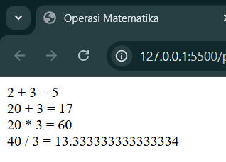

Analisis:
1. Baris pertama menghitung penjumlahan `2 + 3`
2. Baris kedua menghitung pengurangan `20 - 3`
3. Baris ketiga menghitung perkalian `20 * 3`
4. Baris keempat menghitung pembagian `40 / 3`
5. Baris keempat menghitung pembagian `40 / 3`

<h2>12. Operator Logika Dan Perbandingan</h2>

Output: 
Gambar 1

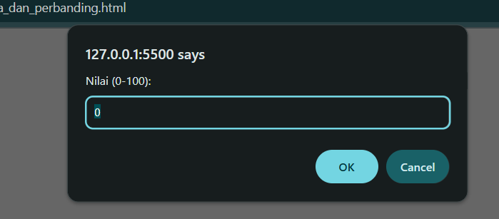

Gambar 2

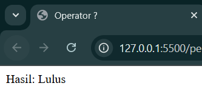

Gambar 3

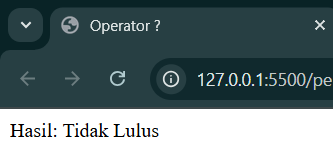

Analisis:
1. Baris `var nilai = prompt("Nilai (0-100): ", 0);` menampilkan dialog input untuk meminta pengguna memasukkan nilai antara 0 sampai 100. Nilai yang dimasukkan akan disimpan dalam variabel `nilai`.

2. Baris `var hasil = (nilai >= 60) ? "Lulus" : "Tidak Lulus";` menggunakan operator ternary: 
Jika `nilai` lebih besar atau sama dengan 60, maka `hasil` berisi `"Lulus"`. 
Jika `nilai` kurang dari 60, maka `hasil` berisi `"Tidak Lulus"`.

5. Baris `document.write("Hasil: " + hasil);` menampilkan hasil kelulusan ke halaman web.

<h2>Tugas Mandiri</h2>

<h2> Tugas Mandiri 1</h2>

Output: 
Gambar 1

Gambar 2

Analisis:
1. `Baris let a = prompt("masukkan nilai yang ingin dikonversi");` menampilkan kotak input pada browser untuk meminta pengguna mengetik sebuah nilai dalam bentuk string. Nilai yang dimasukkan akan disimpan ke variabel `a`.

2. Baris `let konversiInteger = parseInt(a);` mengubah string `a` menjadi bilangan bulat (integer). Jika nilai mengandung desimal, bagian pecahan akan diabaikan.

3. Baris `let konversiFloat = parseFloat(a);` mengubah string `a` menjadi bilangan pecahan (float). Nilai desimal tetap dipertahankan.

4. Baris `document.write(...)` menampilkan hasil konversi integer, dan `document.writeln(...)` menampilkan hasil konversi float di halaman web.

<h2>Tugas Madiri 2</h2>

Output: 
Gambar 1

Gambar 2

.png>)

Gambar 3

.png>)

Gambar 4

.png>)

Analisis:
1. Baris `let a = [];` membuat sebuah array kosong bernama `a`.

2. Baris `let input1 = prompt("Masukkan data pertama");` sampai `input3` digunakan untuk meminta pengguna memasukkan tiga data. Hasil input disimpan dalam variabel `input1`, `input2`, dan `input3`.

3. Baris `a.push(input1);` hingga `a.push(input3);` berfungsi menambahkan data yang dimasukkan pengguna ke dalam array `a`.

4. Bagian `for (let i = 0; i < a.length; i++) { ... }` adalah perulangan yang berjalan sebanyak jumlah elemen dalam array. 
`a.length` memberikan panjang array (jumlah elemen). 
`a[i]` mengakses elemen array pada indeks ke-`i`.

5. Baris `document.write("Array a index ke-" + i + " adalah " + a[i] + " ");` menampilkan isi array beserta indeksnya ke layar.

<h2>Tugas Mandiri 3</h2>

Output: 
Gambar 1 
penambahan

.png>)

Gambar 2 
pengurangan

.png>)

Gambar 3 
perkalian

.png>)

Gambar 4 
Pembagian

.png>)

Analisis:
1. Bagian `<input type="number" id="angka1">` dan `<input type="number" id="angka2">` membuat dua kotak input angka yang diisi pengguna.

2. Empat tombol `<button>` digunakan untuk memilih operasi matematika: tambah, kurang, kali, atau bagi. Saat tombol ditekan, fungsi `hitung(op)` dijalankan dengan parameter `op` sesuai tanda operasi.
Di dalam fungsi `hitung(op)`:

3. `document.getElementById("angka1").value` mengambil nilai dari input pertama, lalu `parseFloat` mengubahnya menjadi angka desimal.

4. `document.getElementById("angka2")`.value mengambil nilai dari input kedua, juga dikonversi ke angka.

5. Variabel `hasil` diset berdasarkan operasi yang dipilih `(+, -, *, atau /)`.

6. `document.getElementById("hasil").innerText = hasil;` menampilkan hasil perhitungan ke dalam elemen ``.

<h2>Tugas Mandiri 4</h2>

Output: 
Gambar 1

 

 Gambar 2

 .png>)

 Analisis:
 1. `Kubu`s 
    Input sisi diambil dengan `document.getElementById("sisi").value`. 
    Rumus volume kubus: `sisi × sisi × sisi`. 
    Hasil ditampilkan pada `
`. 

2. `Balok`  
    Input `panjang`, `lebar`, dan `tinggi` diambil dari tiga kotak input. 
    Rumus volume balok: `panjang × lebar × tinggi`. 
    Hasil ditampilkan pada `
`. 

3. `Bola` 
    Input `jariJariBola` diambil dari kotak input. 
    Rumus volume bola: (4/3) × π × r³. 
    `Math.PI` digunakan untuk π. 
    `toFixed(2)` membatasi hasil menjadi 2 angka di belakang koma. 
    Hasil ditampilkan pada `
`. 

    